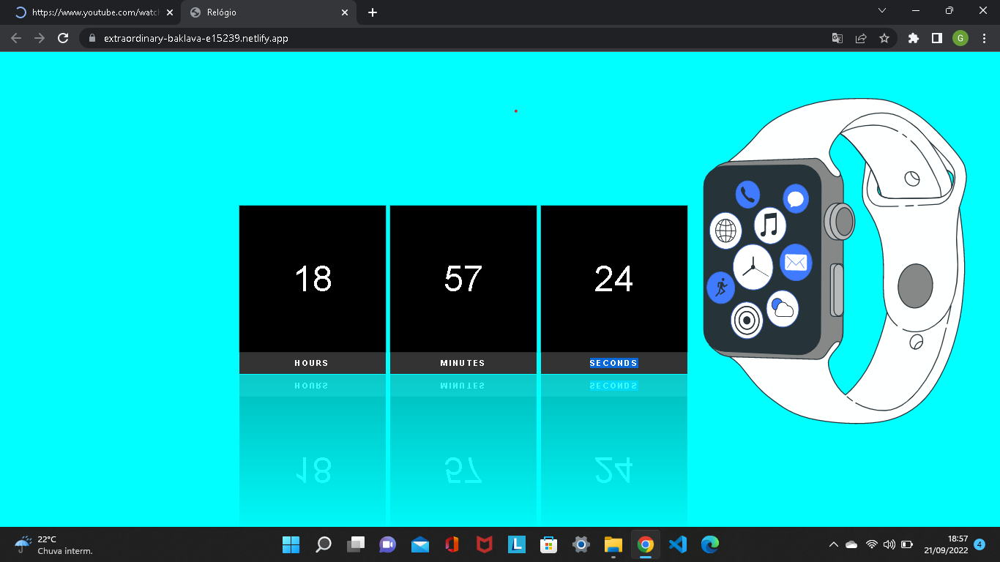

   # Clock-Time

A hora é agora!!

Clock time foi um projeto que aprendi com a professora Shirley Rios, onde é feito a construção de um relógio digital. Tomei a liberdade para alterar algumas coisas como backgrounds, margens, imagem animada, font-zise e responsividade. 

Segue abaixo o link da aula: https://youtu.be/fX3U8FRPkxg

<h2> HOSPEDAGEM DO SITE</h2> :  
# Tecnologias :
- HTML
- CSS
- GIT E GIHUB
- JAVASCRIPT

# Contatos:
- Tel: (19)983006268
- Email: gscardazi@gmail.com
- Linkedin: https://www.linkedin.com/in/guilherme-scardazi-67875a1b8/
   
   
   
   
   
   
   
   
   
   

